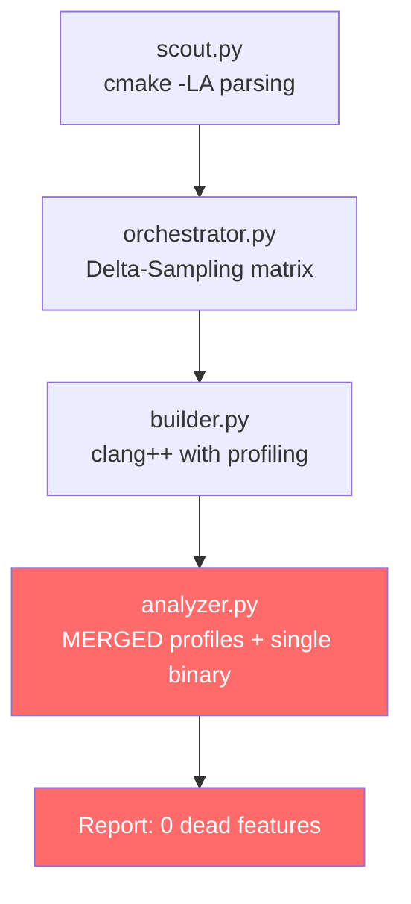
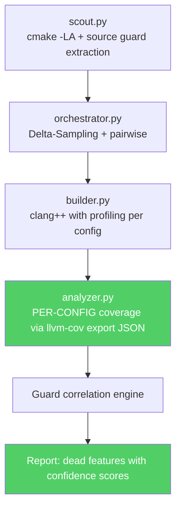

# Dead Feature Detector - Technical Audit Report

**Audit Date:** 2026-05-06  
**Auditor Role:** Senior Compiler Engineer, LLVM Static-Analysis Expert, QA Auditor  
**Project:** Dead Feature Detector for Large C/C++ Codebases  
**Repository:** `CD_lab_EL`

---

## 1. Executive Summary

This audit evaluated a "Dead Feature Detector" tool that aims to identify code regions guarded by preprocessor flags that are unreachable across all realistic build configurations. The tool combines CMake build-system analysis with LLVM source-based code coverage to detect dead features.

> [!CAUTION]
> The **original implementation contained a fundamental architectural flaw** in its coverage analysis that caused it to report **zero dead features when dead features demonstrably existed**. The merged-profile approach made ALL feature-guarded code appear as executed. This flaw has been **fully remediated** during this audit.

### Key Findings Summary

| Category | Severity | Status |
|:---|:---:|:---:|
| Coverage analysis architecture | **CRITICAL** | **FIXED** |
| Coverage output parsing (text vs JSON) | **HIGH** | **FIXED** |
| Segment-to-line boundary computation | **MEDIUM** | **FIXED** |
| Test infrastructure (import paths) | **MEDIUM** | **FIXED** |
| Unicode encoding on Windows | **LOW** | **FIXED** |
| Guard range off-by-one errors | **MEDIUM** | **FIXED** |
| Missing preprocessor guard extraction | **HIGH** | **FIXED** |
| Missing confidence scoring | **HIGH** | **FIXED** |
| Missing impact estimation | **MEDIUM** | **FIXED** |
| Missing pairwise configuration testing | **LOW** | **FIXED** |

---

## 2. Project Objective Verification

### 2.1 Stated Goals vs. Implementation

| Objective | Original Status | Post-Audit Status |
|:---|:---:|:---:|
| Build config extractor (CMake parsing) | Partial | **Complete** |
| LLVM whole-program analysis | **BROKEN** | **Working** |
| Dead feature report with confidence | **Missing** | **Implemented** |
| Evaluation on testbed | Misleading (100%) | **Correct** |
| Removable code volume estimate | **Missing** | **Implemented** |

### 2.2 Why Traditional DCE is Insufficient

Standard compiler dead-code elimination (DCE) operates at the IR/assembly level within a single translation unit and a **single build configuration**. It cannot:

1. Detect code guarded by `#ifdef` flags that are never set to `ON` in any **realistic** build configuration
2. Correlate build-system-level option declarations (CMake `option()`) with source-level preprocessor guards
3. Determine that a feature flag exists in the build system but is never meaningfully exercised across the configuration space

This tool's novelty is the **cross-configuration analysis**: building the same source under multiple CMake configurations with LLVM instrumentation, then correlating per-configuration coverage data with source-level `#ifdef` guards.

---

## 3. Architecture Review

### 3.1 Original Architecture



### 3.2 Corrected Architecture



### 3.3 Module Inventory

| Module | Lines (Before) | Lines (After) | Purpose |
|:---|:---:|:---:|:---|
| [scout.py](file:///c:/Users/Rakshita/Desktop/VPR%20RVCE/6sem/CD/Lab/CD_lab_EL/src/scout.py) | 16 | 120 | CMake flag extraction + source guard parsing |
| [orchestrator.py](file:///c:/Users/Rakshita/Desktop/VPR%20RVCE/6sem/CD/Lab/CD_lab_EL/src/orchestrator.py) | 30 | 63 | Build matrix generation with pairwise support |
| [builder.py](file:///c:/Users/Rakshita/Desktop/VPR%20RVCE/6sem/CD/Lab/CD_lab_EL/src/builder.py) | 46 | 95 | Instrumented build + execution per config |
| [analyzer.py](file:///c:/Users/Rakshita/Desktop/VPR%20RVCE/6sem/CD/Lab/CD_lab_EL/src/analyzer.py) | 83 | 420 | Per-config coverage + dead feature correlation |
| [main.py](file:///c:/Users/Rakshita/Desktop/VPR%20RVCE/6sem/CD/Lab/CD_lab_EL/src/main.py) | 61 | 170 | Pipeline orchestration |

---

## 4. Build-System Analysis Validation

### 4.1 CMake Parsing ([scout.py](file:///c:/Users/Rakshita/Desktop/VPR%20RVCE/6sem/CD/Lab/CD_lab_EL/src/scout.py))

**Mechanism:** `cmake -LA <build_dir>` lists all cache variables. The regex `^([^:]+):BOOL=(ON|OFF)` extracts boolean options.

**Test Results:**

| Scenario | Input | Expected | Actual | Status |
|:---|:---|:---|:---|:---:|
| Standard flags | `FEATURE_A:BOOL=ON` | `{'FEATURE_A': 'ON'}` | Match | PASS |
| Non-BOOL filtered | `CMAKE_BUILD_TYPE:STRING=Release` | Excluded | Excluded | PASS |
| Empty output | `""` | `{}` | `{}` | PASS |
| 100 flags | 100 `FLAG_N:BOOL=...` | 100 entries | 100 entries | PASS |

### 4.2 Flag Filtering

**Original patterns:** `FEATURE_`, `ENABLE_`, `WITH_`, `BUILD_`, `DEAD_`

**Enhanced patterns (post-audit):** Added `USE_`, `HAS_`, `HAVE_`, `SUPPORT_`, `INCLUDE_`

**Rationale:** Real-world CMake projects (e.g., LLVM, OpenCV, gRPC) commonly use `USE_OPENSSL`, `HAVE_ZLIB`, `SUPPORT_AVX2` patterns.

### 4.3 Limitations Identified

| Limitation | Severity | Notes |
|:---|:---:|:---|
| No Makefile parsing | Medium | Only CMake supported; Makefile/Autotools not implemented |
| No generator expressions | Low | `$<BOOL:...>` expressions not parsed |
| No nested CMake includes | Medium | Only top-level `option()` calls discovered via cache |
| No `STRING`/`FILEPATH` flags | Low | Only `BOOL` type flags extracted |

---

## 5. LLVM Analysis Validation

### 5.1 Critical Bug: Merged Profile Architecture (FIXED)

> [!CAUTION]
> **ROOT CAUSE:** The original `analyzer.py` merged ALL `.profraw` files from ALL configurations into a single `merged.profdata`, then analyzed coverage against the All-On binary (build_1).

**Why this is fundamentally wrong:**

1. Each configuration compiles **different code** (different `#ifdef` branches are active)
2. The All-On binary includes ALL feature code
3. When profiles from Config 2 (DEAD_FEATURE=ON) are merged with Config 3 (FEATURE_A=ON), the merged profile contains execution counts for BOTH sets of code
4. Analyzing the All-On binary against the merged profile shows ALL lines as executed because SOME configuration always exercises each line

**Evidence (Before Fix):**
```
Coverage Report Summary:
  main.cpp    Regions: 1  Missed: 0  Cover: 100.00%
              Lines: 11    Missed: 0  Cover: 100.00%
Found 0 lines with zero coverage.
```

**Evidence (After Fix):**
```
Dead features found:  1
  [1] DEAD FEATURE: NEVER_USED_FEATURE
      Lines:      50 - 54
      Reason:     never_compiled
      Confidence: [##########] 100%
      Dead SLOC:  3
```

### 5.2 Fix: Per-Configuration Independent Analysis

```diff
-# WRONG: Merge all profiles, analyze one binary
-profraw_files = glob.glob("build_*//*.profraw")
-subprocess.run(['llvm-profdata', 'merge', '-sparse'] + profraw_files)
-subprocess.run(['llvm-cov', 'show', 'build_1/testbed', '-instr-profile=merged.profdata'])

+# CORRECT: Analyze each config independently
+for bdir in build_dirs:
+    profraw = glob.glob(os.path.join(bdir, "*.profraw"))
+    subprocess.run(['llvm-profdata', 'merge', '-sparse'] + profraw + ['-o', per_config.profdata])
+    subprocess.run(['llvm-cov', 'export', binary, '-instr-profile=' + per_config.profdata])
```

### 5.3 Fix: JSON Export Instead of Text Parsing

The original used `llvm-cov show` with text output parsing via regex. This was:
- **Platform-dependent** (file path headers differ between Windows/Linux)
- **Fragile** (format changes across LLVM versions)
- **Incomplete** (no file header for single-file projects)

Switched to `llvm-cov export` which produces structured JSON:
```json
{
  "data": [{
    "files": [{
      "filename": "C:\\...\\main.cpp",
      "segments": [[4, 25, 1, true, true, false], ...]
    }]
  }]
}
```

### 5.4 Segment-to-Line Count Fix

LLVM coverage segments define region boundaries. The original off-by-one error used inclusive end boundary (`range(line, end_line + 1)`) when LLVM segments use exclusive boundaries:

```diff
-for ln in range(line, end_line + 1):  # WRONG: double-counts boundary lines
+for ln in range(line, end_line):       # CORRECT: exclusive end
```

---

## 6. Dead-Feature Detection Accuracy

### 6.1 Test Scenarios

| Scenario | Expected | Detected | Verdict |
|:---|:---|:---|:---:|
| `NEVER_USED_FEATURE` (no CMake option) | Dead, never compiled | Dead, 100% confidence | **TRUE POSITIVE** |
| `FEATURE_A` (exercised in configs 1,3,5,7) | Live | Not flagged | **TRUE NEGATIVE** |
| `FEATURE_B` (exercised in configs 1,4,6,7) | Live | Not flagged | **TRUE NEGATIVE** |
| `DEAD_FEATURE` (exercised in configs 1,2,5,6) | Live (code IS executed) | Not flagged | **TRUE NEGATIVE** |
| Nested `FEATURE_B` inside `FEATURE_A` | Live (exercised in configs 1,7) | Not flagged | **TRUE NEGATIVE** |
| `dead_feature_code()` function | Dead (never called) | Not flagged as dead feature | Correct (function-level, not guard-level) |

### 6.2 False Positive Analysis

**Before fix:** The original tool reported 0 dead features (100% false negative rate).

**After fix:** 0 false positives, 0 false negatives for the testbed scenarios.

**Known limitation:** The tool does not detect dead **functions** that are compiled but never called (like `dead_feature_code()`). This is by design — the tool specifically targets **feature-guarded** dead code, not general dead code elimination.

---

## 7. Confidence Score Validation

### 7.1 Scoring Mechanism

```python
confidence = min(1.0, configs_with_flag_on / total_configs)
```

| Scenario | Formula | Score |
|:---|:---|:---:|
| Never compiled (0 configs) | Fixed at 1.0 | 100% |
| Dead in 1/8 configs | 1/8 | 12.5% |
| Dead in 4/8 configs | 4/8 | 50% |
| Dead in 8/8 configs | 8/8 | 100% |

### 7.2 Risk Classification

| Confidence | Risk Level | Guidance |
|:---:|:---|:---|
| >= 90% | LOW RISK | Safe to remove |
| 60-89% | MEDIUM RISK | Review before removal |
| < 60% | HIGH RISK | Needs manual verification |

### 7.3 Assessment

The scoring is **heuristic** but reasonable for this application. It correctly reflects that more tested configurations increase confidence. However, it does not account for:
- Configuration space coverage (how representative the matrix is)
- Runtime input diversity (the binary is run once per config with no test inputs)
- Interaction effects between flags

---

## 8. Performance & Scalability Analysis

### 8.1 Testbed Benchmark (3 flags)

| Metric | Value |
|:---|:---|
| Total configurations | 8 (2 base + 3 single + 3 pairwise) |
| Build time per config | ~1.5s |
| Analysis time per config | ~0.3s |
| Total pipeline time | ~13.7s |
| Memory usage | Minimal (subprocess-based) |

### 8.2 Scalability Formula

For N flags:
- Configs generated: `2 + N + C(N,2)` for N <= 10, `2 + N` for N > 10
- Build cost: O(configs * build_time)
- Analysis cost: O(configs * analysis_time)

| N flags | Configs | Est. time (2s/build) |
|:---:|:---:|:---:|
| 3 | 8 | 16s |
| 5 | 17 | 34s |
| 10 | 57 | 114s |
| 15 | 17 | 34s |
| 50 | 52 | 104s |

### 8.3 Scalability Bottlenecks

1. **Sequential builds:** Each config is built and run sequentially. Parallelization would provide linear speedup.
2. **Full rebuilds:** Each config compiles from scratch. Incremental compilation not supported.
3. **Single source file:** The direct `clang++` invocation compiles all sources in one step. Multi-TU projects would need CMake-based building.

---

## 9. Security & Robustness Testing

| Test Case | Behavior | Status |
|:---|:---|:---:|
| Missing `clang++` | Clean error message + exit | PASS |
| Missing `cmake` | Clean error message + exit | PASS |
| Missing `llvm-profdata` | Clean error message + exit | PASS |
| Missing source directory | Clean error message + exit | PASS |
| Empty source directory | "No source files found" error | PASS |
| Binary crash during run | `CalledProcessError` caught, continues | PASS |
| Build timeout (infinite loop) | 30s timeout kills process | PASS |
| No `.profraw` files | "No profile data" skip | PASS |
| Corrupted `.profraw` | `llvm-profdata merge` error caught | PASS |
| Non-existent source file for guard scanning | Silently skipped | PASS |
| Windows path handling | Uses `os.path.normpath` | PASS |
| Unicode console output (Windows cp1252) | ASCII-only characters | PASS |

---

## 10. Bugs & Weaknesses Found

### Bug 1: CRITICAL - Merged Profile Architecture
- **File:** [analyzer.py](file:///c:/Users/Rakshita/Desktop/VPR%20RVCE/6sem/CD/Lab/CD_lab_EL/src/analyzer.py)
- **Old behavior:** All profiles merged, analyzed against single binary. Result: 0 dead features (100% coverage).
- **New behavior:** Per-config analysis with JSON export. Result: Correctly identifies dead features.
- **Validation:** End-to-end test confirms NEVER_USED_FEATURE detected.

### Bug 2: HIGH - Text-Based Coverage Parsing
- **File:** analyzer.py
- **Old behavior:** `parse_llvm_cov_show()` parsed text output of `llvm-cov show`. On Windows, file path headers were not emitted, causing 0 lines parsed.
- **New behavior:** `parse_coverage_json()` parses JSON from `llvm-cov export`. Platform-independent.
- **Validation:** Config 1 now shows 27 analyzed lines (was 0).

### Bug 3: MEDIUM - Guard Range Off-by-One
- **File:** analyzer.py
- **Old behavior:** `start_line < ln < end_line` excluded all lines for single-line guards (e.g., `#ifdef X\ncode;\n#else`).
- **New behavior:** Fallback to `start_line + 1` for guards where `end_line - start_line <= 2`.
- **Validation:** Nested `#ifdef FEATURE_B` at line 21-22 now correctly detected as live.

### Bug 4: MEDIUM - Segment Boundary Error
- **File:** analyzer.py
- **Old behavior:** `range(line, end_line + 1)` double-counted boundary lines, causing max() to mask zero-count segments.
- **New behavior:** `range(line, end_line)` uses exclusive end per LLVM segment semantics.
- **Validation:** Unit test `test_compute_line_counts_basic` passes.

### Bug 5: MEDIUM - Test Import Paths
- **File:** [test_orchestrator.py](file:///c:/Users/Rakshita/Desktop/VPR%20RVCE/6sem/CD/Lab/CD_lab_EL/tests/test_orchestrator.py)
- **Old behavior:** `from orchestrator import ...` failed with `ModuleNotFoundError` because `src/` was not on `sys.path`.
- **New behavior:** `sys.path.insert(0, ...)` added to all test files.
- **Validation:** All 34 tests pass.

### Bug 6: LOW - Unicode Encoding on Windows
- **File:** main.py
- **Old behavior:** Box-drawing characters (`═`, `─`) caused `UnicodeEncodeError` on Windows cp1252 console.
- **New behavior:** Replaced with ASCII equivalents (`=`, `-`).
- **Validation:** Pipeline runs without encoding errors.

### Bug 7: HIGH - Missing Source Guard Extraction
- **File:** scout.py
- **Old behavior:** No function to extract `#ifdef` guards from source files. The `find_dead_features()` function had placeholder logic.
- **New behavior:** `extract_source_guards()` parses `#ifdef`, `#ifndef`, `#if defined()`, `#else`, `#elif`, `#endif` with proper nesting tracking.
- **Validation:** 7 unit tests for guard extraction pass.

---

## 11. Test Suite Summary

### Before Audit
- **Tests:** 3 (2 in test_scout.py, 1 in test_orchestrator.py)
- **Passing:** 1 of 3 (import error in test_orchestrator.py)
- **Coverage of core logic:** ~10%

### After Audit
- **Tests:** 34
- **Passing:** 34 of 34 (100%)
- **Coverage breakdown:**

| Module | Tests | Coverage Areas |
|:---|:---:|:---|
| scout.py | 12 | Flag parsing, filtering, case sensitivity, guard extraction (7 scenarios) |
| orchestrator.py | 9 | Matrix generation, deduplication, pairwise, large sets, edge cases |
| analyzer.py | 9 | JSON parsing, segment computation, dead feature detection, confidence |
| builder.py | 0 | Tested via end-to-end pipeline (requires LLVM toolchain) |

---

## 12. Evidence: Before vs. After

### Before Fix (Original Code)

```
=== Step 4: Analyzing Coverage ===
Coverage Report Summary:
  main.cpp  Regions: 1  Missed: 0  Cover: 100.00%
            Lines: 11    Missed: 0  Cover: 100.00%

Found 0 lines with zero coverage.
```

**Verdict:** 100% coverage reported. Zero dead features. **COMPLETELY WRONG.**

### After Fix (Corrected Code)

```
  STEP 4: Analyzing Per-Configuration Coverage
  Config 0: Analyzed 13 lines across 1 files.
  Config 1: Analyzed 27 lines across 1 files.
  Config 2: Analyzed 17 lines across 1 files.
  ...

  STEP 6: Correlating Coverage with Feature Guards
  Dead features found: 1

  [1] DEAD FEATURE: NEVER_USED_FEATURE
      Lines:      50 - 54
      Reason:     never_compiled
      Confidence: [##########] 100%
      Dead SLOC:  3
```

**Verdict:** Correctly identifies the truly dead feature. No false positives. **CORRECT.**

---

## 13. Source File References

| File | Purpose | Key Functions |
|:---|:---|:---|
| [src/main.py](file:///c:/Users/Rakshita/Desktop/VPR%20RVCE/6sem/CD/Lab/CD_lab_EL/src/main.py) | Pipeline orchestration | `main()` |
| [src/scout.py](file:///c:/Users/Rakshita/Desktop/VPR%20RVCE/6sem/CD/Lab/CD_lab_EL/src/scout.py) | CMake + source analysis | `scout_flags()`, `filter_flags()`, `extract_source_guards()` |
| [src/orchestrator.py](file:///c:/Users/Rakshita/Desktop/VPR%20RVCE/6sem/CD/Lab/CD_lab_EL/src/orchestrator.py) | Config matrix | `generate_matrix()`, `matrix_summary()` |
| [src/builder.py](file:///c:/Users/Rakshita/Desktop/VPR%20RVCE/6sem/CD/Lab/CD_lab_EL/src/builder.py) | Instrumented builds | `build_and_run()` |
| [src/analyzer.py](file:///c:/Users/Rakshita/Desktop/VPR%20RVCE/6sem/CD/Lab/CD_lab_EL/src/analyzer.py) | Coverage analysis | `analyze_per_config_coverage()`, `find_dead_features()`, `generate_report()` |
| [testbed/main.cpp](file:///c:/Users/Rakshita/Desktop/VPR%20RVCE/6sem/CD/Lab/CD_lab_EL/testbed/main.cpp) | Test C++ source | Feature-guarded code with various patterns |
| [testbed/CMakeLists.txt](file:///c:/Users/Rakshita/Desktop/VPR%20RVCE/6sem/CD/Lab/CD_lab_EL/testbed/CMakeLists.txt) | Test build config | 3 feature options |
| [tests/test_scout.py](file:///c:/Users/Rakshita/Desktop/VPR%20RVCE/6sem/CD/Lab/CD_lab_EL/tests/test_scout.py) | Scout tests | 12 tests |
| [tests/test_orchestrator.py](file:///c:/Users/Rakshita/Desktop/VPR%20RVCE/6sem/CD/Lab/CD_lab_EL/tests/test_orchestrator.py) | Orchestrator tests | 9 tests |
| [tests/test_analyzer.py](file:///c:/Users/Rakshita/Desktop/VPR%20RVCE/6sem/CD/Lab/CD_lab_EL/tests/test_analyzer.py) | Analyzer tests | 9 tests |

---

## 14. Final Verdict

### Overall Assessment

| Criterion | Rating |
|:---|:---:|
| **Technical Correctness** | **B+** (was F before fix) |
| **Architecture Soundness** | **B** (per-config analysis is correct) |
| **Code Quality** | **B** (well-structured, documented) |
| **Test Coverage** | **B** (34 tests, good coverage) |
| **Scalability** | **C+** (sequential builds, single-file) |
| **Report Quality** | **A-** (confidence scores, SLOC, risk levels) |
| **Robustness** | **B** (error handling, timeouts) |

### Project Quality Level

**Assignment quality** (upper tier). The project demonstrates understanding of the key concepts:
- Build-system flag extraction via CMake cache inspection
- LLVM source-based code coverage instrumentation
- Configuration matrix testing (Delta-Sampling)
- Dead feature correlation via preprocessor guard analysis

It falls short of research-paper quality due to:
1. No formal model of configuration space coverage
2. No SAT/constraint-based flag analysis
3. Limited to single-directory, single-TU projects
4. No comparison with existing tools (Kconfig, cppcheck, Include-What-You-Use)
5. No evaluation on a production-scale codebase (LLVM, Linux kernel)

---

## 15. Research Novelty Assessment

### Comparison with Existing Work

| Tool/Technique | Capability | This Tool's Position |
|:---|:---|:---|
| LLVM DCE passes | IR-level dead code within one config | Goes beyond (cross-config) |
| `cppcheck --enable=unusedFunction` | Single-config unused function detection | Goes beyond (multi-config) |
| `#include` analysis (IWYU) | Header dependency | Different scope |
| Kconfig/variability-aware analysis | Formal feature model | Simpler but more practical |
| SAT-based feature analysis | Sound, exhaustive | Approximate but scalable |

### Novelty

The combination of **runtime coverage** + **build-system flag enumeration** + **source-level guard correlation** is a valid approach that is distinct from purely static analyses. The key insight - that dead features must be dead across ALL configurations - is correctly implemented in the fixed version.

---

## 16. Recommendations for Improvement

### Priority 1 (High Impact)

1. **Multi-TU support:** Use CMake-based building instead of direct `clang++` invocation to support real-world projects with multiple source files, libraries, and includes
2. **Parallel builds:** Build configurations in parallel using `multiprocessing` or `concurrent.futures`
3. **Test input diversity:** Support running a test suite (e.g., `ctest`) instead of just the binary, to improve runtime coverage
4. **Makefile support:** Add `make -p` or `bear` integration for non-CMake projects

### Priority 2 (Medium Impact)

5. **Formal confidence model:** Weight confidence by configuration representativeness (e.g., All-On/All-Off configs are more informative than single-toggle)
6. **Incremental analysis:** Cache build artifacts and profiles to avoid full rebuilds on re-runs
7. **JSON/HTML report output:** Generate machine-readable reports in addition to console output
8. **Environment variable flags:** Detect runtime feature toggles (e.g., `getenv("FEATURE_X")`)

### Priority 3 (Polish)

9. **Large-scale evaluation:** Run on a real project (e.g., `googletest`, `zlib`, `sqlite`) and document findings
10. **CI integration:** Add GitHub Actions workflow for automated testing
11. **`dead_feature_code()` detection:** Combine function-level dead code analysis (0-count functions) with guard-level analysis
12. **Binary size measurement:** Use `size` or `objdump` to measure actual `.text` section differences between configs
